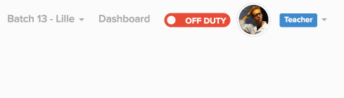

# Onboarding @ Le Wagon

You have read the [guidelines](README.md) & this is your mission :

## Requirements

- [gravatar](http://fr.gravatar.com/) picture associated with your email
- [GitHub account](https://github.com)

## Access

Your first mission is to send an email to unlock your access. Here is an example:

> Hello, 
> I am a teacher for lewagon #{city}. 
> Email: #{teacher@lewagon.org} 
> GitHub: #{username} 
> All the best, 
> {name}

…wait a moment…

## How Le Wagon works ?

### karr

All the courses are here [karr.lewagon.org](http://karr.lewagon.org/). At the beginig of each day, you need to give your morning talk form here (on fullscreen).

__protip:__ during live coding session avoid to use alias or shortcuts, you can show them but one step at a time, we don't want to loose our sudents.

When your morning course is over you can switch to kitt & introduce the exercices of the day.

### kitt

[kitt.lewagon.org](http://kitt.lewagon.org/) is our learning platform. Students work here.

__protip:__ don't forget to turn on your status.

Please force students to make tickets when they need help. We can fix mistakes & update excercices _with real data_.

### Slack

[lewagon-alumni.slack.com](http://lewagon-alumni.slack.com) is our main communication tool.

__protip:__ As in the commit message, we talk in english here.

### alumni (Bonus)

”Sharing is caring“ and if you have great links or ressource you should post it here [alumni.lewagon.org](http://alumni.lewagon.org/)
